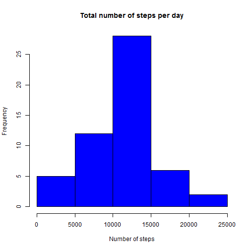
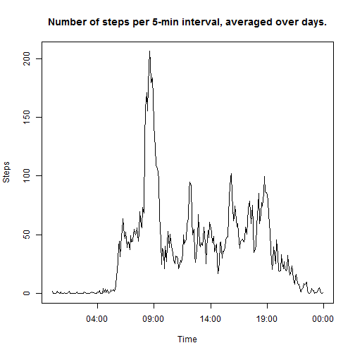
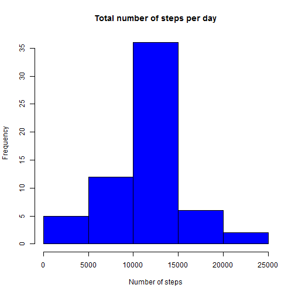
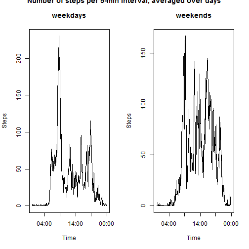

Peer-reviewed assignment for week2 of the 'Reproducible Research' course
========================================================================

---
title: "PA1_template.Rmd"
author: "Jakko de Jong"
date: "15 februari 2017"
output: html_document
---

## Explanation

In this article, I explain the steps taken in R (version 3.3.2) to perform some exploratory data analysis on dataset [Activity monitoring data](https://d396qusza40orc.cloudfront.net/repdata%2Fdata%2Factivity.zip).  

First, I check if the dataset is available in the working directory, and if not, I download and unpack it:


```r
if(!file.exists("activity.csv")){
        download.file("https://d396qusza40orc.cloudfront.net/repdata%2Fdata%2Factivity.zip", "activity.zip")
        unzip("activity.zip")
}
```

Then, I read the data into memory:


```r
act <- read.csv("activity.csv", header = TRUE, stringsAsFactors = FALSE)
```

I convert `act$date` from string to Date, and parse `act$interval` with leading zeros using the `stringr` package. This helps to later turn it into timestamps for plots. I create a new data frame `act2` without the missing values in the dataset.


```r
library(stringr)
act$date <- as.Date(act$date, "%Y-%m-%d")
act$interval <- str_pad(as.character(act$interval), 4, pad = "0")
act2 <- act[complete.cases(act),]
```


```r
# Plot1
act2sum <- aggregate(act2$steps, by = list(act2$date), sum)
names(act2sum) <- c("date","steps")
hist(act2sum$steps, main = "Total number of steps per day", xlab = "Number of steps", col = "blue")
```


Plot1 shows a histogram of the total number of steps taken per day. The majority of days show a total of steps between 10k and 15k. If we look at the quartiles and the mean:


```r
summary(act2sum$steps)
```

```
##    Min. 1st Qu.  Median    Mean 3rd Qu.    Max. 
##      41    8841   10760   10770   13290   21190
```
we see that the average number of steps per day is 10770, slightly higher than the median (10760).


```r
# Plot2
act2mean <- aggregate(act2$steps, by = list(act2$interval), mean)
names(act2mean) <- c("interval","steps")
plot(as.POSIXct(act2mean$interval, format = "%H%M"), act2mean$steps, type = "l", xlab = "Time", ylab = "Steps", main = "Number of steps per 5-min interval, averaged over days.")
```



Plot2 shows the number of steps binned per 5 minute interval, averaged over all days in the dataset. The highest activity (~206 steps) is observed at 08:35h in the morning. The studied subject seems to wake up around 5:30h and goes to bed at 23:00h. 


```r
max(act2mean$steps)
```

```
## [1] 206.1698
```

```r
format(act2mean$interval[act2mean$steps == max(act2mean$steps)], format = "%H:%M")
```

```
## [1] "0835"
```

To correct for missing `act$steps` values in the original dataset, we fill in the average value for the corresponding timebin with the following steps:


```r
# Plot3
colSums(is.na(act))
```

```
##    steps     date interval 
##     2304        0        0
```

```r
act$steps[is.na(act$steps)] <- sapply(act$interval[is.na(act$steps)], FUN = function(x) act2mean$steps[act2mean$interval == x])
```

Plot3 is similar to plot1, but now with the filled in missing values included. 


```r
actsum <- aggregate(act$steps, by = list(act$date), sum)
names(actsum) <- c("date","steps")
hist(actsum$steps, main = "Total number of steps per day", xlab = "Number of steps", col = "blue")
```



```r
summary(actsum$steps)
```

```
##    Min. 1st Qu.  Median    Mean 3rd Qu.    Max. 
##      41    9819   10770   10770   12810   21190
```

Logically, the total number of steps is now higher. Furthermore, inserting averages for the missing values make the distribution of values narrower, as is observed in the histogram and the fact that the first and third quartile are now closer to the mean value.  
  
For the last plot, we first create a new boolean column using the `ifelse()` function to indicate whether that interval was taken on a weekday or during the weekend. Plot4 shows similar info as plot2, but now corrected for the moment of the week the actvitiy took place in.


```r
# Plot4
par(mfrow = c(1,2))
act$weekday <- ifelse(weekdays(act$date) %in% c("maandag","dinsdag","woensdag","donderdag","vrijdag"), TRUE, FALSE)
# plot for weekdays
actweekday <- act[act$weekday,]
actweekdaymean <- aggregate(actweekday$steps, by = list(actweekday$interval), mean)
names(actweekdaymean) <- c("interval","steps")
plot(as.POSIXct(actweekdaymean$interval, format = "%H%M"), actweekdaymean$steps, type = "l", xlab = "Time", ylab = "Steps", main = "weekdays")
# plot for weekend
actweekend <- act[!act$weekday,]
actweekendmean <- aggregate(actweekend$steps, by = list(actweekend$interval), mean)
names(actweekendmean) <- c("interval","steps")
plot(as.POSIXct(actweekendmean$interval, format = "%H%M"), actweekendmean$steps, type = "l", xlab = "Time", ylab = "Steps", main = "weekends")
title("Number of steps per 5-min interval, averaged over days", outer=TRUE)
```



Two rather different patterns occur, where during the weekend the activity is more spread out over the day.
